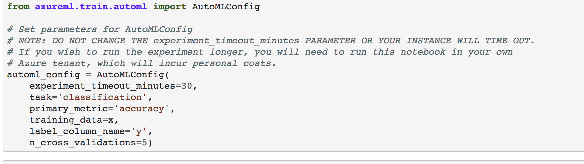

# Optimizing an ML Pipeline in Azure

## Overview
This project is part of the Udacity Azure ML Nanodegree.
In this project, we build and optimize an Azure ML pipeline using the Python SDK and a provided Scikit-learn model.
This model is then compared to an Azure AutoML run.

## Summary


Dataset

The dataset comprises of a bank's marketing campaign which captures the details about the customer based on the calls made to them regarding bank term deposits. We seek to predict via a classification predictive model to predict whether a customer will subscribe to the banks' scheme or not.


The best perrforming model was the model with Run ID 16 having an accuracy score of **0.916**


## Scikit-learn Pipeline

**Explain the pipeline architecture, including data, hyperparameter tuning, and classification algorithm.**

Pipeline architecture consisted of the following steps:

SKLearn pipeline

- Data import and cleansing was done using the 
- Creating cluster config using *AmlCompute* class's provisioning_configuration function from the *azureml.core.compute*
- Creating a compute cluster using **ComputeTarget** class of *azureml.core.compute*
- Specifying Parameter sampler
- Specifying Earlystopping criteria for efficient execution
- Creating a SKLearn estimator pointed to the train.py as the entry_script which performed the data cleansing and Logistic Regression Model definition code
- Instantiating a HyperDriveConfig with hyperparameters including sampler, early_stopping, max_concurrent_runs, max_total_runs, primary_metric_name and goal
- Submitting the experiment and display continuous output using azureml widgets

AutoML pipeline

- Imported data using TabularDatasetFactory from dataset_factory
- Used **AutoMLConfig** from *azureml.train.automl* to define 
  - task type -> Classification
  - Primary_metric -> accuracy
  - Num cross validations -> n_cross_validation
- This config was used to submit the experiment to using <experiment_name>.submit which took automl config as input and the show_outputs as True to be able to view output of the run as it progressed.
- Best run was captured using automl_run.get_output() at the end of the experiment
- Best run had an accuracy of **0.9172**


<u>Q1 **What are the benefits of the parameter sampler you chose?**</u>

I specified the parameter sampler as below:

```
ps = RandomParameterSampling({"--C":uniform(0.05, 0.1), 
                              "--max_iter": quniform(100,150,100)
                             })
```

I chose discrete values with *choice* for both parameters, *C* and *max_iter*.

*C* is the Regularization while *max_iter* is the maximum # of iterations.

I chose *Random sampling* which supports discrete and continuous hyperparameters and early termination of low-performance runs. Other choices available are *Grid sampling* and *Bayesian sampling* which perform more exhaustive search over the search space and may require more budget.

<u>Q2 **What are the benefits of the early stopping policy you chose?**</u>

***Early stopping policy***

An early termination policy helps <u>***automatically end poorly performing runs***</u>. Early termination also improves ***computational efficiency***. 

I've used [*BanditPolicy*](https://docs.microsoft.com/en-us/python/api/azureml-train-core/azureml.train.hyperdrive.banditpolicy#definition) as defined below:

```
policy = BanditPolicy(slack_factor=0.1, evaluation_interval=1, delay_evaluation=5)
```

- *slack_factor*: The amount of slack allowed with respect to the best performing training run. This factor specifies the slack as a ratio.
- *evaluation_interval*: This is optional and corresponds to the frequency at which the policy is applied during the run. Each time the training script logs the primary metric counts as one interval. The value **1** signifies that the policy will be applied every time a primay metric is logged.


Any run that doesn't fall within the slack factor or slack amount of the evaluation metric with respect to the best performing run will be terminated. This means that with this policy, the best performing runs will execute until they finish and this is the reason I chose it.


## AutoML
**In 1-2 sentences, describe the model and hyperparameters generated by AutoML.**

- Azure AutoML is a no code environment, capable of training many different models in a short period of time like RandomForests, BoostedTrees, XGBoost, LightGBM, SGDClassifier, VotingEnsemble, etc.

The best run achieved from autoML was VotingEnsemble with an accuracy of **0.91721**


AutoML config used are as below:-




## Pipeline comparison

Both the pipelines - SKLearn and AutoML had a very close best run acurracy of **~0.92**

**AutoML** advantage lies in it being a no code environment and supports multiple out of the box Machine learning algorithms that can be applied concurrently for model evaluation

**Hyperdrive** provides multiple policies and parameters for hyperparameter optimization and helps optimize the run times of the experiment based on the defined policy. It has the potential to help automate ML pipelines which are scalable and performant.


## Future work
- Make the train.py more reusable for other use cases - specify any dataset with the problem type (classification/regression) with some predefined options of algorithms and hyperdrive configs
- Leverage AutoML's feature of feature importance for ML problems and generate the stats in an output file
- Handle outliers in the data using tree based methods

## Proof of cluster clean up

**Image of cluster marked for deletion**


## Appendix


Other details of both the runs for reference:

##### **Logistic Regression**


Metrics


Top runs


Top run details


Top run  id -16


##### AUTOML

Top model: VotingEnsemble


Data gaurdrails


Explanation


Top 10 features


